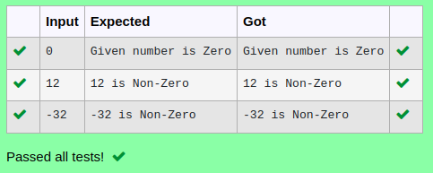

# Ex.No:1(C) CONTROL STATEMENTS

## AIM:
To develop a Java program to check given number is zero or not.

## ALGORITHM :
1.	Start the program.
2.	Declare an integer variable 'num'
3.	Create a Scanner object 'sc' to read input from the user
4.	Read an integer input from the user and store it in 'num'
5.	Check if 'num' is equal to 0:
a.	If true, print "Given number is Zero"
b.	If false, print 'num' followed by " is Non-Zero"
6.	End


## PROGRAM:
 ```
Program to implement a class & objects using Java
Developed by    : Sam Israel D 
RegisterNumber  : 212222230128
```

## Sourcecode.java:

```java
import java.util.Scanner;

public class Demo
{
    public static void main(String[] args)
    {
       Scanner sc = new Scanner(System.in);
       int num=sc.nextInt();
        if(num == 0)
        System.out.println("Given number is Zero");
        else
        System.out.format("%d is Non-Zero",num);
    }
}
```


## OUTPUT:



## RESULT:
Thus, the Java program to check given number is zero or not was created successfully.

