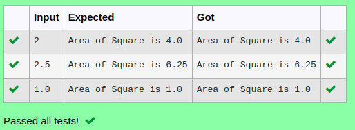

# Ex.No:1(D) USER DEFINED METHOD.

## AIM:
To create a Java program print area of rectangle by defining instance method and local variable value as 10,20 .[Class Name is ‘Area’ function name is ‘calculateArea()’ and return type of function is ’void’

## ALGORITHM :
1.	Start the program.
2.	Define a class named 'Area'
3.	Declare a public method named 'calculateArea' with no parameters
4.	Inside the 'calculateArea' method:
    -	Declare a Double variable 'length' and assign it the value 10.0
    -	Declare a Double variable 'width' and assign it the value 20.0
    -	Calculate the area by multiplying 'length' and 'width' and store the result in a Double variable 'area'
    -	Print the calculated area using the System.out.println statement
5.	Define the 'main' method as static
6.	Inside the 'main' method:
    -  Create an instance of the 'Area' class called 'rectangle'
    -  Call the 'calculateArea' method on the 'rectangle' object


## PROGRAM:
 ```
Program to implement a User Defined Method using Java
Developed by    : Sam Israel D 
RegisterNumber  : 212222230128
```

## Sourcecode.java:

```java
import java.util.*;
public class Area {
        void calculateArea()
    {
        double side,cirarea;
        Scanner sc=new Scanner(System.in);
        side=sc.nextDouble();
        cirarea=side*side;
        System.out.println("Area of Square is "+cirarea);
    }
    public static void main(String[] args) {
        Area obj = new Area();
        obj.calculateArea();
        }
}
```


## OUTPUT:



## RESULT:
Thus, the Java program to print area of rectangle by defining instance method and local variable value as 10,20 was created successfully.

