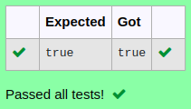

# Ex.No:1(E)  INSTANCE METHOD AND VARIABLE

## AIM:
To write a Java program to check whether the number 2003 is prime or not using an instance method and instance variable. The class is named Prime, and the method isPrime() returns a boolean indicating whether the number is prime.

## ALGORITHM :
1. Start the program.
2. Create a class named `Prime`.
3. Declare an instance variable `number` in the class.
4. Define a constructor to initialize the `number` variable.
5. Create an instance method `isPrime()` with return type `boolean`.
6. In the `isPrime()` method:
   - Check if the number is less than or equal to 1. If so, return false.
   - Use a loop to check for factors from 2 up to the square root of the number.
   - If any factor divides the number evenly, return false.
   - If no factors are found, return true.
7. In the `main` method:
   - Create an object of the `Prime` class, initializing it with the number 2003.
   - Call the `isPrime()` method using the object.
   - Print whether the number is prime based on the method's return value.
8. End the program.


## PROGRAM:
 ```
Program to implement a Static Variable using Java
Developed by    : Sam Israel D 
RegisterNumber  : 212222230128 
```

## Sourcecode.java:

```java
import java.util.*;
public class Prime {
    int num = 2003, count=0;
    boolean isPrime() {
        for(int i=1; i<=num/2;i++) {
            if (num%i==0) {
                count+=1;
            }
        }
        return (count==1);
    }
    public static void main(String[] args) {
        Prime obj = new Prime();
        System.out.println(obj.isPrime());
    }
}
```


## OUTPUT:



## RESULT:
Thus, the Java program for the concept of using a static variable for shared data was correctly implemented and verified successfully. 

