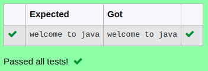

# Ex.No:2(B) ACCESS MODIFIERS

## AIM:
To develop a Java Program display "welcome to java" using modifiers.

## ALGORITHM :
1. Start the program.
2. Create a class named `A`.
3. Inside the class, define an instance method named `display()`.
   - In this method, print the message "welcome to java" using `System.out.println()`.
4. Define the `main` method.
5. Inside the `main` method:
   - Create an object `obj` of class `A`.
   - Call the instance method `display()` using the object `obj`.
6. End the program.


## PROGRAM:
 ```
Program to implement a access modifiers using Java
Developed by    : Sam Israel D 
RegisterNumber  : 212222230128
```

## Sourcecode.java:

```java
public class A 
{ 
public void display()
    { 
        System.out.println("welcome to java") ;
    } 

    public static void main(String args[])
    {
        A obj = new A();
        obj.display();
    }
}
```


## OUTPUT:



## RESULT:
Thus the java program to display the addition number using access modifiers only was executed successfully.


