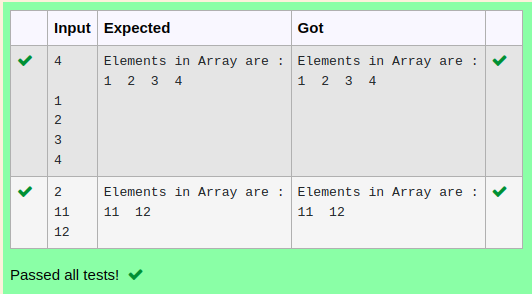

# Ex.No:2(C)    SINGLE ARRAY

## AIM:
To create a java program to read n values and display the all n values from array using single dimensional array.

## ALGORITHM :
1.	Start the program.
2.	Import the `Scanner` class from the `java.util` package
3.	Define a class named `ArrayExample`
4.	Inside the `main` method:
    - Create a `Scanner` object called `scanner` to take user input
    - Declare an integer array `values` of size n
    - Use a `for` loop to iterate from `i = 0` to `i < n`:
    - Take input from the user and store it in `values[i]`
5.	Print "Elements in Array are :"
6.	Use another `for` loop to iterate from `i = 0` to `i < n`:
    - Print each element in `values` followed by a space
7.	Close the `scanner` to release resources
8.	End


## PROGRAM:
 ```
Program to implement a Single Array using Java
Developed by    : Sam Israel D 
RegisterNumber  : 212222230128  
```

## Sourcecode.java:


```java
import java.util.*;
public class prog {
    public static void main(String[] args){
        Scanner sc = new Scanner(System.in);
        int n = sc.nextInt();
        int[] arr = new int[n];
        System.out.println("Elements in Array are :");
        for(int i=0;i<n;i++){
            arr[i] = sc.nextInt();
            System.out.print(arr[i]+"  ");
        }
    }
}
```


## OUTPUT:



## RESULT:
Thus, the Java program Thus the java program to read n values and display the all n values from array using single dimensional  was executed successfully.


