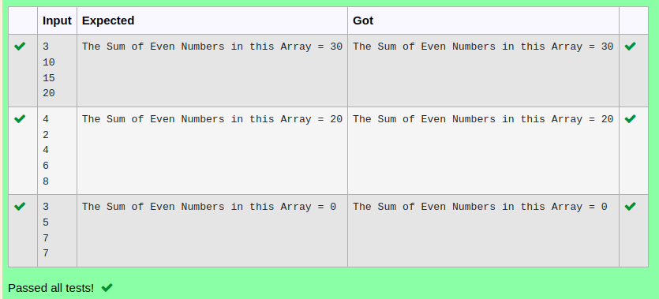

# Ex.No:2(D) MULTI-DIMENSIONAL ARRAY

## AIM:
To create a java program that returns the sum of all the even values in a 2D array.

## ALGORITHM :
1.	Start the program.
2.	Import `Scanner` and define class `sum`
3.	In `main`:
    - Create `Scanner` object `sc`
    - Read `rows` and `cols` from user
    - Declare 2D array `arr[rows][cols]`
4.	Populate `arr` using nested loops with user input
5.	Initialize `sum` to `0`
6.	Calculate the sum of all even elements in `arr` using nested loops
7.	Print "The sum of all values in the 2D array is: " + `sum`
8.	End


## PROGRAM:
 ```
Program to implement a Multi Dimensional Array using Java
Developed by    : Sam Israel D 
RegisterNumber  : 212222230128
```

## Sourcecode.java:


```java
import java.util.*;
public class Main{
    public static void main(String[] args){
        Scanner sc  = new Scanner(System.in);
        int n = sc.nextInt();
        int arr[] = new int[n];
        int sum=0;
        for(int i=0;i<n;i++){
            arr[i]=sc.nextInt();
            if(arr[i]%2==0)
            sum+=arr[i];
        }
        System.out.println("The Sum of Even Numbers in this Array = "+sum);
    }
}
```


## OUTPUT:



## RESULT:
Thus the java program that returns the sum of all the even values in a 2D array was executed successfully.


