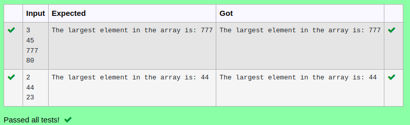

# Ex.No:2(E)  LARGEST ELEMENT IN AN ARRAY

## AIM:
To write a Java program that reads an array size and elements from the user and then finds and prints the smallest element in the array.
## ALGORITHM :
1.	Start the program.
2.	Read the size of the array from the user.
3.	Declare an array of the given size.
4.	Read the array elements from the user.
5.	Initialize a variable max with 0.
6.	Traverse the array using a loop.
7.	Compare each element with max. If an element is larger, update max.
8.	After the loop ends, print the largest number.
9.	End the program.
	

## PROGRAM:
 ```
Program to implement a Largest Element in an Array
Developed by    : Sam Israel D 
RegisterNumber  : 212222230128
```

## Sourcecode.java:


```java
import java.util.*;
public class Main{
    public static void main(String[] args){
        Scanner sc = new Scanner(System.in);
        int n = sc.nextInt();
        int []arr = new int[n];
        int largest = 0;
        for(int i=0;i<n;i++){
            arr[i] = sc.nextInt();
            if(arr[i]>largest){
                largest = arr[i];
            }
        }
        System.out.println("The largest element in the array is: "+largest);
    }
}
```


## OUTPUT:



## RESULT:
Thus the java program successfully reads the array size and elements from the user and correctly finds and prints the largest number in the array.


