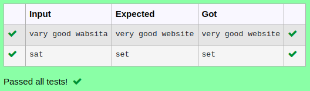

# Ex.No:3(A)  STRING AND ITS OPERATIONS IN JAVA
## AIM:
To create a java program to read input and replace character in word in java.

## ALGORITHM :
1.  Start the Program.  
2.  Import `Scanner` and define class `Main`  
3.  In `main`:  
-   a) Create `Scanner` object `sc`  
-   b) Read a line of text into `String` variable `str`  
4.  Replace all occurrences of `'a'` with `'e'` in `str`  
5.  Print the modified string  
6.  End  


## PROGRAM:
 ```
Program to implement a String and its Operations using Java
Developed by    : Sam Israel D 
RegisterNumber  : 212222230128
```

## Sourcecode.java:


```java
import java.util.*;
public class Main{
    public static void main(String[] args){
        Scanner sc = new Scanner(System.in);
        String str = sc.nextLine();
        System.out.println(str.replace("a","e"));
    }
}
```


## OUTPUT:



## RESULT:
Thus the java Program to read input and replace character in word in java was executed successfully.

