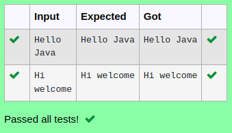

# Ex.No:3(B) STRING BUFFER IN JAVA

## AIM:
To develop a java program use append() method concatenates the given argument with this String and use stringbuffer class.

## ALGORITHM :
1.	Start the program.
2.	Import `Scanner` and define class `concat`
3.	In `main`:
-	a) Create `Scanner` object `sc`
-	b) Read two strings `a` and `b` from user input
4.	Create a `StringBuffer` object `sb` initialized with string `a`
5.	Append a space and string `b` to `sb`
6.	Print the concatenated result from `sb`
7.	End


## PROGRAM:
 ```
Program to implement a String Buffer using Java
Developed by    : Sam Israel D 
RegisterNumber  : 212222230128 
```

## Sourcecode.java:

```java
import java.util.*;
public class Demo{
    public static void main(String[] args)
    {
        Scanner sc = new Scanner (System.in);
        String a = sc.nextLine();
        String b = sc.nextLine();
        StringBuffer sb = new StringBuffer(a);
        sb.append(" "+b);
        System.out.println(sb);
    }
}
```


## OUTPUT:




## RESULT:
Thus the java program use append() method concatenates the given argument with this String and use stringbuffer class was executed successfully.