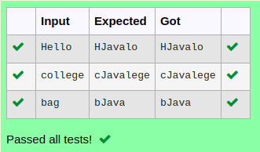

# Ex.No:3(C)    STRING BUILDER IN JAVA

## AIM:
To Create a java program use replace() method replaces the given String from the specified beginIndex and endIndex and use stringbuilder

## ALGORITHM :
1.  Start the Program
2.	Import `Scanner` and define class `replace`
3.	In `main`:
-	a) Create `Scanner` object `sc`
-	b) Read a string `str` from user input
4.	Create a `StringBuilder` object `sb` initialized with `str`
5.	Use the `replace()` method to replace characters from index 1 to 3 with "Java"
6.	Print the modified string using `sb.toString()`
7.	End


## PROGRAM:
 ```
Program to implement a String Builder using Java
Developed by    : Sam Israel D 
RegisterNumber  : 212222230128 
```

## Sourcecode.java:


```java
import java.util.*;
public class StringBufferExample3{  
    public static void main(String args[]){ 
        Scanner sc=new Scanner(System.in);
        String str=sc.nextLine();
        StringBuffer sb=new StringBuffer(str);  
        sb.replace(1,3,"Java");  
        System.out.println(sb); 
    }  
}  
```


## OUTPUT:



## RESULT:
Thus the java program use replace() method replaces the given String from the specified beginIndex and endIndex and use stringbuilder was executed successfully.


