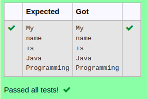

# Ex.No:3(D) STRING TOKENIZER IN JAVA

## AIM:
To create a java program using StringTokenizer class that tokenizes a string "My name is Java Programming" on the basis of whitespace.

## ALGORITHM :
1.	Start the Program
2.	Import `Scanner` and `StringTokenizer` and define class `tok`
3.	In `main`:
-	a) Create `Scanner` object `sc`
-	b) Initialize the string `str` as "My name is Java Programming"
4.	Create a `StringTokenizer` object `token` to tokenize `str`
5.	Use a `while` loop to iterate through tokens:
-	a) Print each token using `token.nextToken()`
6.	End


## PROGRAM:
 ```
Program to implement a String Tokenizer using Java
Developed by    : Sam Israel D 
RegisterNumber  : 212222230128 
```

## Sourcecode.java:

```java
import java.util.*;
public class Main{
    public static void main(String[] args){
        StringTokenizer str = new StringTokenizer("My name is Java Programming"," ");
        while(str.hasMoreTokens()){
            System.out.println(str.nextToken());
        }
    }
}
```


## OUTPUT:



## RESULT:
Thus the java program using StringTokenizer class that tokenizes a string "My name is Java Programming" on the basis of whitespace was executed successfully.
