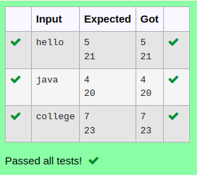

# Ex.No:3(E)  STRINGBUILDER OBJECT REFERENCE IN JAVA

## AIM:
To write a Java program that creates a StringBuilder object using a given string and assigns its reference to the variable sb.

## ALGORITHM :
1.	Start the program.
2.	Declare and initialize a string variable str1.
3.	Create a StringBuilder object by passing str1 to its constructor.
4.	Store the object reference in the variable sb.
5.	Print the contents of sb to verify the output.
6.	End the program.


## PROGRAM:
 ```
Program to implement a StringBuilder Object Reference in Java
Developed by    : Sam Israel D 
RegisterNumber  : 212222230128 
```

## Sourcecode.java:

```java
import java.util.*;
public class Main{
    public static void main(String[] args){
        Scanner sc = new Scanner(System.in);
        StringBuilder sb = new StringBuilder(sc.next());
        System.out.println(sb.length()+"\n"+sb.capacity());
    }
}
```


## OUTPUT:



## RESULT:
Thus the  Java program successfully creates a StringBuilder object using the given string and stores the reference in the variable sb. The contents of the object are printed using the reference variable.

