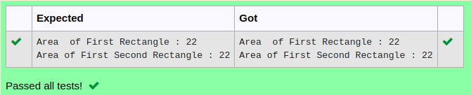

# Ex.No:4(A)  JAVA CONSTRUCTOR
## AIM:
To create a Java program using constructor to print the circumference of rectangle.[l=5,w=6]

## ALGORITHM :
1.  1.	Start the Program.
2.	Define a class `circum`
3.	Inside the class, define two integer variables `l` and `w` with values 5 and 6, respectively
4.	Create a constructor `circum()`:
-	a) Calculate the `circumference` as `2 * (l + w)`
-	b) Print the `circumference` twice with different labels ("Area of First Rectangle" and "Area of Second Rectangle")
5.	In `main`, create an object `sc` of the `circum` class
6.	End


## PROGRAM:
 ```
Program to implement a Constructor using Java
Developed by    : Sam Israel D 
RegisterNumber  : 21222230128 
```

## Sourcecode.java:


```java
class Rectangle 
 { 
         int length; 
         int breadth; 
         //constructor to initialize length and bredth of rectang of rectangle 
         Rectangle(int l, int b) 
         {   
            this.length = l; 
            this.breadth= b; 
         } 
         //copy constructor 
         Rectangle(Rectangle obj) 
         { 
           length = obj.length; 
           breadth=obj.breadth; 
         } 
        //method to calcuate area of rectangle 
        int circumference() 
        { 
           return (2*(length + breadth)); 
        } 
 } 
        //class to create Rectangle object and calculate area 
  public      class CopyConstructor 
 { 
           public static void main(String[] args) 
           { 
             Rectangle firstRect = new Rectangle(5,6); 
             Rectangle secondRect= new Rectangle(firstRect); 
             System.out.println("Area  of First Rectangle : "+ firstRect.circumference()); 
             System .out.println("Area of First Second Rectangle : "+ secondRect.circumference()); 
           } 
 } 
 

```


## OUTPUT:



## RESULT:
Thus the Java program using constructor to print the circumference of rectangle was executed successfully.
