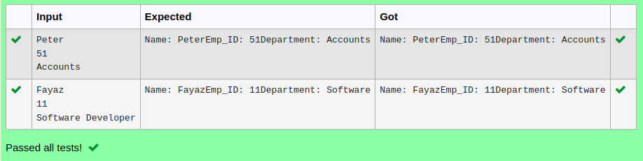

# Ex.No:4(B) INTRODUCTION TO JAVA INHERITANCE

## AIM:
To create  a Java program to perform the inheritance concept for employee details.

## ALGORITHM :
1.	Start the Program
2.	Define class `Person`:
-	a) Declare `emp_id`, `name`, and `dept` as instance variables
3.	Define class `Employee` that extends `Person`:
-	a) Define method `getDetails()`:
-	i) Create a `Scanner` object `sc`
-	ii) Read `name`, `emp_id`, and `dept` from user input
-	b) Define method `display()`:
-	i) Print the `name`, `emp_id`, and `dept`
4.	Define `Main` class with `main` method:
-	a) Create an `Employee` object `emp`
-	b) Call `getDetails()` to input employee details
-	c) Call `display()` to output employee details
5.	End


## PROGRAM:
 ```
Program to implement a Inheritance using Java
Developed by    : Sam Israel D 
RegisterNumber  : 21222230128 
```

## Sourcecode.java:


```java
import java.util.Scanner;
class Person
{
    String name;
}
class Employee extends Person
{
    int emp_id;
    String dept;
    
    void getDetails(String name,int emp_id,String dept)
    {
        name = name;
        emp_id = emp_id;
        dept = dept;
       
    }
    void display(String name,int emp_id,String dept)
    {
       System.out.println("Name: "+name+"Emp_ID: "+emp_id+"Department: "+dept);
    }
}
public class Main
{
    public static void main(String[] args)
    {
        Scanner sc=new Scanner(System.in);
        Employee obj=new Employee();
        obj.name=sc.nextLine();
        obj.emp_id=sc.nextInt();
        obj.dept=sc.next();
        obj.getDetails(obj.name,obj.emp_id,obj.dept);
        obj.display(obj.name,obj.emp_id,obj.dept);
    }
}
```


## OUTPUT:



## RESULT:
Thus, the Java program to implement the inheritance concept for employee details was  executed successfully.

