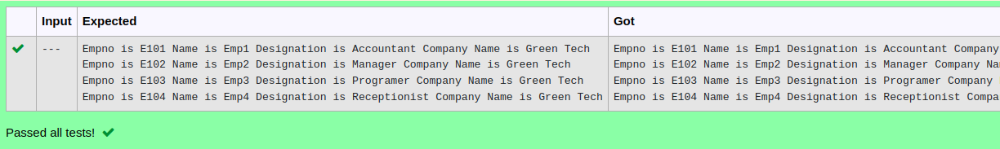

# Ex.No:4(D) FINAL & STATIC IN JAVA

## AIM:
   To create a Java program to display Employee's details [ E.No, Name, Designation ] with Company name. Company name is "Green Tech" which is common to all Employees. The Company name field is declared as static so it can occupy memory only once.

## ALGORITHM :
1.  Start the Program.  
2.  Define class `Student` with:  
-   a) Static variable `company` initialized to `"Green Tech"`  
-   b) Instance variables `E_No`, `name`, and `desg`  
-   c) Method `display()` that prints employee details along with the company name  

3.  Define class `StaticVariableExample`  
4.  In `main`:  
-   a) Create object `student1` of class `Student`  
-   b) Set `E_No` to `"E101"`, `name` to `"Emp1"`, and `desg` to `"Accountant"`  
-   c) Call `display()` method of `student1`  

-   d) Create object `student2` of class `Student`  
-   e) Set `E_No` to `"E102"`, `name` to `"Emp2"`, and `desg` to `"Manager"`  
-   f) Call `display()` method of `student2`  

-   g) Create object `student3` of class `Student`  
-   h) Set `E_No` to `"E103"`, `name` to `"Emp3"`, and `desg` to `"Programer"`  
-   i) Call `display()` method of `student3`  

-   j) Create object `student4` of class `Student`  
-   k) Set `E_No` to `"E104"`, `name` to `"Emp4"`, and `desg` to `"Receptionist"`  
-   l) Call `display()` method of `student4`  

5.  End  


## PROGRAM:
 ```
Program to implement a final & Static using Java
Developed by    : Sam Israel D 
RegisterNumber  : 21222230128 
```

## Sourcecode.java:


```java
public class StaticVariableExample {
    public static void main(String[] args) {
        Student student1 = new Student();
        student1.E_No="E101";
        student1.name="Emp1";
        student1.desg="Accountant";
        student1.display();

        Student student2 = new Student();        
        student2.E_No="E102";
        student2.name="Emp2";
        student2.desg="Manager";
        student2.display();
        
        Student student3 = new Student();
        student3.E_No="E103";
        student3.name="Emp3";
        student3.desg="Programer";
        student3.display();
        
        Student student4 = new Student();
        student4.E_No="E104";
        student4.name="Emp4";
        student4.desg="Receptionist";
        student4.display();
    }
}

class Student {
    static String company = "Green Tech";
    String E_No;
    String name;
    String desg;
    void display()
    {
        System.out.println("Empno is "+E_No+" Name is "+name+" Designation is "+desg+" Company Name is "+company);
    }
}
```


## OUTPUT:



## RESULT:
Thus, the java program to perform final & static keyword was executed successfully.
