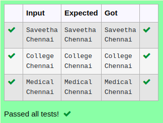

# Ex.No:5(A)  DATA HIDING AND ENCAPSULATION
## AIM:
To Create a java program to display name and location of the employee and use the encapsulation concepts

## ALGORITHM :
1.  Start the program
2.	Define class `Employee`:
-	a) Declare two private `String` variables: `name1` and `name2`
-	b) Define `setname(String n1)` method to set `name1` to `n1`
-	c) Define `setname2(String n2)` method to set `name2` to `n2`
-	d) Define `get1()` method to return `name1`
-	e) Define `get2()` method to return `name2`
3.	Define `Main` class with `main` method:
-	a) Create `Scanner` object `sc` for input
-	b) Read `name1` and `name2` from user input
-	c) Create ` Employee ` object `hl`
-	d) Use `hl.setname(name1)` and `hl.setname2(name2)` to set the names
-	e) Print the values of `hl.get1()` and `hl.get2()`
4.	End


## PROGRAM:
 ```
Program to implement a Data Hiding & Encapsulation using Java
Developed by    : Sam Israel D 
RegisterNumber  : 21222230128 
```

## Sourcecode.java:

```java
import java.util.*;
class Encapsulation{
    private String name, place;
    public void setString(String name, String place){
        this.name = name;
        this.place = place;
    }
    public String getName(){
        return name;
    }
    public String getPlace(){
        return place;
    }
}
public class Main{
    public static void main(String[] args){
        Scanner sc = new Scanner(System.in);
        String name = sc.next();
        String place = sc.next();
        Encapsulation encap = new Encapsulation();
        encap.setString(name, place);
        System.out.println(encap.getName()+"\n"+encap.getPlace());
    }
}
```


## OUTPUT:



## RESULT:
Thus , the  java program to display name and location of the employee and use the encapsulation concepts executed successfully.
