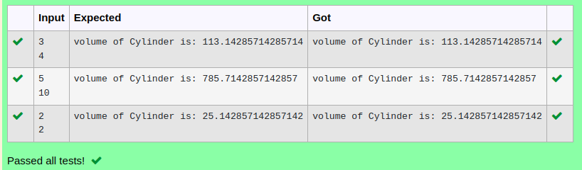

# Ex.No:5(B) TIGHTLY ENCAPSULATED CLASS

## AIM:
To Create a java program to display the value of volume of cylinder get the radius and height value as input and use tightly encapsulated class.

## ALGORITHM :
1.	Start the program.
2.	Define `Cylinder` class:
-	a) Private variables `radius` and `height`
-	b) `setRadius(int r)` and `setHeight(int h)` methods to set values
-	c) `getVolume()` method:
- i) Calculate and print `volume = pi * radius * radius * height`
3.	In `Main` class `main` method:
-	a) Use `Scanner` to read `radius` and `height`
-	b) Create `Cylinder` object, set values, and call `getVolume()`
4.	End


## PROGRAM:
 ```
Program to implement a tightly encapsulated class using Java
Developed by    : Sam Israel D 
RegisterNumber  : 21222230128 
```

## Sourcecode.java:


```java
import java.util.*;
import java.lang.Math;
class Volume{
    private int r, h;
    Volume(int radius, int height){
        this.r = radius;
        this.h = height;
    }
    
    void vol(){
        double v = (22*r*r*h)/7.0;
        System.out.println("volume of Cylinder is: "+v);
    }
}
public class Main{
    public static void main(String[] args){
        Scanner sc = new Scanner(System.in);
        int r = sc.nextInt();
        int h = sc.nextInt();
        Volume v = new Volume(r, h);
        v.vol();
    }
}
```


## OUTPUT:



## RESULT:
Thus a java program to display the value of volume of cylinder get the radius and height value as input and use tightly encapsulated class was executed successfully.


