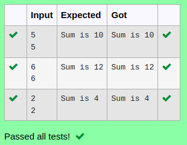

# Ex.No:5(C)    GETTER AND SETTER METHOD

## AIM:
To Create a java program to print the sum of two number using getter and setter method.

## ALGORITHM :
1.  Start the Program
2.	Define class `Employee`:
-	a) Private variables `n1` and `n2`
-	b) Method `setsum(int n1, int n2)` to set values of `n1` and `n2`
-	c) Method `getsum()` to calculate and print `sum = n1 + n2`
3.	In `main` class `main` method:
-	a) Use `Scanner` to read integers `n1` and `n2`
-	b) Create ` Employee ` object, set values, and call `getsum()`
4.	End


## PROGRAM:
 ```
Program to implement a Getter and Setter using Java
Developed by    : Sam Israel D 
RegisterNumber  : 21222230128 
```

## Sourcecode.java:

```java
import java.util.*;
class Demo{
    private int a;
    private int b;
    public void set(int a,int b)
    {
        this.a=a;
        this.b=b;
    }
    public int get()
    {
        return a+b;
    }
}

public class Main{
    public static void main(String[] args)
    {
        Scanner sc = new Scanner(System.in);
        int a  = sc.nextInt();
        int b = sc.nextInt();
        Demo D = new Demo();
        
        D.set(a,b);
        System.out.println("Sum is "+D.get());
    }
}
```


## OUTPUT:



## RESULT:
Thus the java program to print the sum of two number using getter and setter method was executed successfully.


