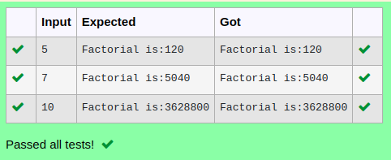

# Ex.No:5(D) IS-A RELATIONSHIP AND HAS-A RELATIONSHIP
## AIM:
   To Create a java program to find factorial of number using class and object concepts and apply the has-a relationship.
 
## ALGORITHM :
1.	Start the Program
2.	Define class `A`:
-	a) Declare integer `n` and initialize `fact` to 1
-	b) Define method `factorial(int n)`:
-	i) Set `this.n = n`
-	ii) Use a loop from 1 to `n` to calculate `fact = fact * i`
-	iii) Print "Factorial is:" followed by `fact`
3.	In `main` class `main` method:
-	a) Use `Scanner` to read integer `n`
-	b) Create an `A` object and call `factorial(n)`
4.	End

## PROGRAM:
 ```
Program to implement a IS-A RELATIONSHIP AND HAS-A RELATIONSHIP using Java
Developed by    : Sam Israel D 
RegisterNumber  : 21222230128 
```

## Sourcecode.java:


```java
import java.util.*;
class Factorial{
    int n;
    Factorial(int n){
        this.n = n;
    }
    void fact(){
        int sum=1;
        for(int i=1;i<=n;i++){
            sum*=i;
        }
        System.out.println("Factorial is:"+sum);
    }
}
public class Main{
    public static void main(String[] args){
        Scanner sc = new Scanner(System.in);
        Factorial fac = new Factorial(sc.nextInt());
        fac.fact();
    }
}
```


## OUTPUT:



## RESULT:
Thus the java program to find factorial of number using class and object concepts and apply the has-a relationship was executed successfully.