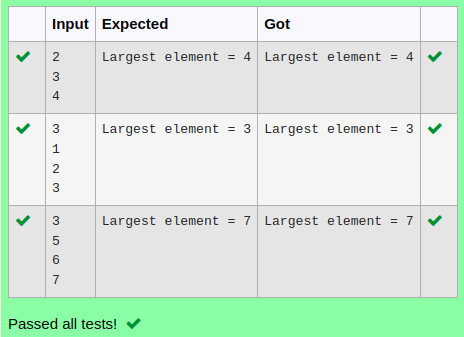

# Ex.No:5(E) HAS-A RELATIONSHIP
## AIM:
To implement a  Java Program to Find the Largest or Max Number in Array using has - a relationship.
## ALGORITHM :
1.	Start the program.
2.	Create a class ArrayData:
a.	Declare an integer array and a variable for size.
b.	Create a method to read array elements from the user.
3.	Create another class ArrayOperation:
a.	Create a method findMax() that accepts an ArrayData object.
b.	Loop through the array and find the largest element.
4.	In the main() method of a class Main:
a.	Create an object of ArrayData and read the input.
b.	Create an object of ArrayOperation and call findMax() by passing the ArrayData object.
5.	Display the largest number.
6.	End the program.


## PROGRAM:
 ```
Program to implement a HAS-A RelationShip
Developed by    : Sam Israel D 
RegisterNumber  : 21222230128 
```

## Sourcecode.java:

```java
import java.util.Scanner;

class ArrayHandler {
    public int findMax(int[] arr) {
        int max = arr[0];
        for (int i = 1; i < arr.length; i++) {
            if (arr[i] > max) {
                max = arr[i];
            }
        }
        return max;
    }
}

class ArrayOperations {
    private ArrayHandler arrayHandler;
    
    public ArrayOperations() {
        arrayHandler = new ArrayHandler(); 
    }
    
    public void printMaxElement(int[] arr) {
        int max = arrayHandler.findMax(arr);
        System.out.println("Largest element = " + max);
    }
}

public class Main {
    public static void main(String[] args) {
        Scanner scanner = new Scanner(System.in);
        int size = scanner.nextInt();
        int[] arr = new int[size];
        for (int i = 0; i < size; i++) {
            arr[i] = scanner.nextInt();
        }
        ArrayOperations arrayOperations = new ArrayOperations();
        arrayOperations.printMaxElement(arr);

        scanner.close();
    }
}

```


## OUTPUT:



## RESULT:
Thus the java program to Find the Largest or Max Number in Array using has - a relationship was executed successfully. 

