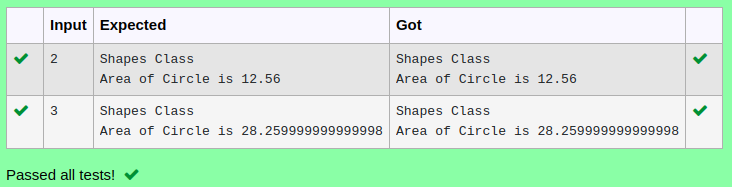

# Ex.No:6(B) MULTI-LEVEL INHERITANCE

## AIM:
To Develop a Java program to perform Multilevel Inheritance to calculate the area of circle..

## ALGORITHM :
1.	Start the Program.
2.	Define class `Shapes`:
-	a) Method `print_shape()` to print "Shapes Class"
3.	Define class `Circle` that extends `Shapes`:
-	a) Declare integer `rad`
-	b) Method `get()` to read `rad` from user input
4.	Define class `Area` that extends `Circle`:
-	a) Method `cal()` to calculate `result = 3.14 * rad * rad` and print "Area of Circle is " followed by `result`
5.	In `Main` class `main` method:
-	a) Create `Area` object `obj`
-	b) Call `print_shape()`, `get()`, and `cal()` on `obj` to display shape type, read radius, and calculate area
6.	End


## PROGRAM:
 ```
Program to implement a MultiLevel Inheritance using Java
Developed by    : Sam Israel D 
RegisterNumber  : 21222230128 
```

## Sourcecode.java:

```java
import java.util.*;
class Shapes
{
    void print_Shape(){
        System.out.println("Shapes Class");
    }
}
class Circle extends Shapes
{
    int r;
    void get()
    {
        Scanner sc=new Scanner(System.in);
        r = sc.nextInt();
    }
}
class Area extends Circle
{
    double area;
    void calc()
    {
        area=3.14*r*r;
        System.out.println("Area of Circle is "+area);
    }
}
public class Main
{
    public static void main(String[] args)
    {
        Area obj=new Area();
        obj.print_Shape();
        obj.get();
        obj.calc();
    }
}
```


## OUTPUT:



## RESULT:
Thus the java program for multi-level inheritance was executed successfully.


