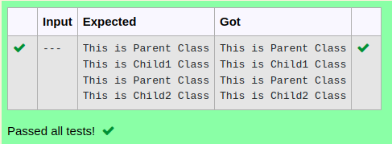

# Ex.No:6(C)             HIERARCHICAL INHERITANCE 

## AIM:
  To Develop a Java program to perform Hierarchical Inheritance for below scenario Parent have method " display" to display "This is Parent Class". Child1 have method "print" to display "This is Child1 Class" Child1 have method "print" to display "Child2 Class". In Main create object for both child1 and child2 and access its member function.


## ALGORITHM :
1.  Start the Program
2.	Define class `Parent`:
-	a) Method `show()` to print "This is Parent Class"
3.	Define class `Child1` that extends `Parent`:
-	a) Method `print()` to print "This is Child1 Class"
4.	Define class `Child2` that extends `Parent`:
-	a) Method `display()` to print "This is Child2 Class"
5.	In `Main` class `main` method:
-	a) Create `Child1` object `child` and call `show()` and `print()` on it
-	b) Create `Child2` object `chi` and call `show()` and `display()` on it
6.	End


## PROGRAM:
 ```
Program to implement a Hierarchical Inheritance using Java
Developed by    : Sam Israel D 
RegisterNumber  : 21222230128 
```

## Sourcecode.java:


```java
class Parent{
    void display(){
        System.out.println("This is Parent Class");
    }
}
class Child1 extends Parent{
    void print(){
        System.out.println("This is Child1 Class");
    }
}
class Child2 extends Parent{
    void print(){
        System.out.println("This is Child2 Class");
    }
}
public class Main{
    public static void main(String[] args){
        Child1 ch1 = new Child1();
        Child2 ch2 = new Child2();
        ch1.display();
        ch1.print();
        ch2.display();
        ch2.print();
    }
}
```


## OUTPUT:



## RESULT:
Thus the java program for Hierarchical inheritance was executed successfully.


