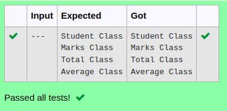

# Ex.No:6(E)  MULTIPLE INHERITANCE

## AIM:
To write a Java program using multiple inheritance through interfaces to read student details and marks, calculate the average, and display the mark sheet.

## ALGORITHM :

1.	Start the program.
2.	Create interface Student:
a.	Declare methods to read name and rollno.
3.	Create interface Studentdet:
a.	Declare a method to read marks of 6 subjects and calculate the average.
b.	Create a class Studentdetails that implements both interfaces:
c.	Define variables for name, roll number, marks array, and average.
4.	Implement all methods from the interfaces.
a.	Create a display() method to show student details and average.
5.	In main() method:
a.	Create an object of Studentdetails.
b.	Call the methods to get input and display results.
6.	End the program.


## PROGRAM:
 ```
Program to implement a Multiple Inheritance
Developed by    : Sam Israel D 
RegisterNumber  : 21222230128 
```

## Sourcecode.java:

```java
class Student{
    Student(){
        System.out.println("Student Class");
    }
}
class Marks extends Student{
    Marks(){
        System.out.println("Marks Class");
    }
}
class Total extends Marks{
    Total(){
        System.out.println("Total Class");
    }
}
class Average extends Total{
    Average(){
        System.out.println("Average Class");
    }
}
public class Main{
    public static void main(String[] args){
        Average a = new Average();
    }
}
```


## OUTPUT:



## RESULT:

Thus, the java program demonstrates multiple inheritance using interfaces and successfully displays the mark sheet of a student by collecting personal and academic data. 
