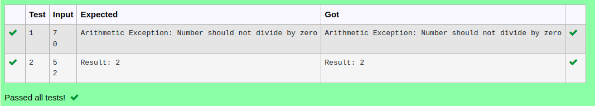

# Ex.No:7(A)           EXCEPTION HANDLING-RUN TIME EXCEPTION
## AIM:
  To Develop a Java Program for handling Arithmetic Exception (division by zero exception) using Exception Handling Mechanism.

## ALGORITHM :
1.  Start the Program
2.	Import `java.util.*` for input handling
3.	Define class `Example1`:
-	a) In `main` method, create `Scanner` object `sc` for input
4.	Use `try` block to:
-	a) Read integers `a` and `b` from user input
-	b) Calculate `res = a / b` and print "Result: " followed by `res`
5.	Use `catch` block to handle `ArithmeticException`:
-	a) If division by zero occurs, print "You Shouldn't divide a number by zero"
6.	End


## PROGRAM:
 ```
Program to implement a Exception Handling-Run Time Exception using Java
Developed by    : Sam Israel D 
RegisterNumber  : 212222230128 
```

## Sourcecode.java:


```java
import java.util.*;
public class ExceptionHandling{
    public static void main(String[] args){
        int n1,n2;
        Scanner sc = new Scanner(System.in);
        n1=sc.nextInt();
        n2=sc.nextInt();
        try{
            System.out.println("Result: "+n1/n2);
        } catch (ArithmeticException e){
            System.out.println("Arithmetic Exception: Number should not divide by zero");
        }
    }
}
```


## OUTPUT:



## RESULT:
Thus the Java Program for handling Arithmetic Exception (division by zero exception) using Exception Handling Mechanism was executed successfully.

