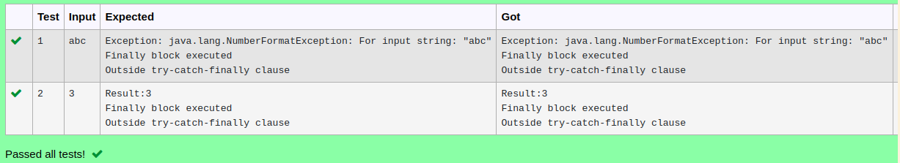

# Ex.No:7(B) EXCEPTION HANDLING-FINALLY
## AIM:
To Write a Java program to demonstrate control flow of try-catch-finally clause when NumberFormat Exception occur in try block and handled in catch block


## ALGORITHM :
1.	Start the Program
2.	Import `java.util.*` for input handling
3.	Define class `HelloWorld`:
-	a) In `main` method, create `Scanner` object `sc` for input
4.	Use `try` block to:
-	a) Read a string `str` from user input
-	b) Convert `str` to an integer using `Integer.parseInt()` and print the result
5.	Use `catch` block to handle `NumberFormatException`:
-	a) If the string can't be converted to an integer, print the exception message
6.	Use `finally` block to:
-	a) Print "Finally block executed"
7.	After the `try-catch-finally` block, print "Outside try-catch-finally clause"
8.	End


## PROGRAM:
 ```
Program to implement a Exception Handling-Finally using Java
Developed by    : Sam Israel D 
RegisterNumber  : 212222230128 
```

## Sourcecode.java:


```java
import java.util.*;
public class HelloWorld {
    public static void main(String[] args) 
    {
        Scanner sc = new Scanner(System.in);
        try
        {
            int n = Integer.parseInt(sc.nextLine());
            System.out.println("Result:"+n);
        }
        catch(Exception e)
        {
            System.out.println("Exception: "+e);
        }
        finally
        {
            System.out.println("Finally block executed");
        }
        System.out.println("Outside try-catch-finally clause");
    }
}
```


## OUTPUT:



## RESULT:
Thus the Java program to demonstrate control flow of try-catch-finally clause when NumberFormatException occur in try block and handled in catch block was executed successfully.


