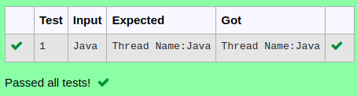

# Ex.No:7(C)             THREAD IN JAVA
## AIM:
 To Develop a Java program to create Thread using Thread class.


## ALGORITHM :
1.  Start the Program
2.	Import necessary classes: `java.util.*`
3.	Define a class `Multi` that extends `Thread`:
-	a) Create a `Scanner` instance for user input.
-	b) Override the `run` method:
-	i) Read a string from user input.
-	ii) Print "Thread Name:" followed by the input string.
4.	In the `main` method:
-	a) Create an instance of `Multi`.
-	b) Create a new `Thread` instance using the `Multi` object.
-	c) Start the thread with `t1.start()`.
5.	End


## PROGRAM:
 ```
Program to implement a Thread concepts using Java
Developed by    : Sam Israel D 
RegisterNumber  : 212222230128 
```

## Sourcecode.java:


```java
import java.util.*;
public class Multi extends Thread
{  
     Scanner sc = new Scanner(System.in);
     public void run(){
         String str = sc.nextLine();
         System.out.println("Thread Name:"+str);
    }
    public static void main(String args[])
    {  
        Multi t = new Multi();
        t.start();
    }  
}  
```


## OUTPUT:



## RESULT:
Thus the Java program for the creation of Thread using Thread class was executed successfully.


