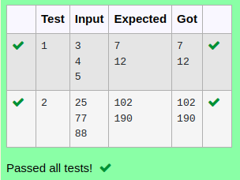

# Ex.No:7(E)  POLYMORPHISM

## AIM:
To implement method overloading in Java to calculate the sum of two and three numbers demonstrating compile-time polymorphism
## ALGORITHM :
1.	Start the program.
2.	Create a class named SumExample.
3.	Inside the class, define:
     a.	A method sum(int a, int b) to calculate the sum of two numbers.
     b.	An overloaded method sum(int a, int b, int c) to calculate the sum of three numbers.
4.	In the main() method:
      a.	Create an object of the SumExample class.
      b.	Call both versions of the sum() method with appropriate arguments.
      c.	Print the results.
5.	End the program.


## PROGRAM:
 ```
Program to implement a Method Overloading in Java
Developed by    : Sam Israel D 
RegisterNumber  : 212222230128 
```

## Sourcecode.java:

```java
import java.util.*;
public class Calculator{
    public void sum(int n1, int n2){
        System.out.println(n1+n2);
    }
    public void sum(int n1, int n2, int n3){
        System.out.println(n1+n2+n3);
    }
    public static void main(String[] args){
        Scanner sc = new Scanner(System.in);
        int n1 = sc.nextInt();
        int n2 = sc.nextInt();
        int n3 = sc.nextInt();
        Calculator cal = new Calculator();
        cal.sum(n1,n2);
        cal.sum(n1,n2,n3);
    }
}
```


## OUTPUT:




## RESULT:

Thus the  java program successfully demonstrates method overloading, showing compile-time polymorphism by calculating the sum of two and three numbers using methods with the same name but different parameter lists..


