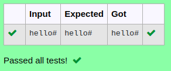

# Ex.No:8(E)  INPUT STREAM READER.

## AIM:
To write a Java program that takes continuous input from the user using InputStreamReader and exits when the input ends with the symbol #. The input is taken inside a do-while loop.
## ALGORITHM :
1.	Start the program.
2.	Import java.io.*.
3.	Create an InputStreamReader and wrap it in a BufferedReader.
    -	Use a do-while loop to:
    -	Prompt and read input from the user.
    -	Check if the input ends with #.
4.	If yes, break the loop.
    -	Otherwise, print the input.
    -	Close the input stream.
5.	End the program


## PROGRAM:
 ```
Program to implement a INPUT STREAM READER
Developed by    : Sam Israel D 
RegisterNumber  : 212222230128 
```

## Sourcecode.java:

```java
import java.io.*;
public class ReadConsole {

   public static void main(String args[]) throws IOException {
      InputStreamReader cin = null;

        try {
            cin = new InputStreamReader(System.in);
            char c;
            do {
                c = (char) cin.read();
                System.out.print(c);
             } while(c != '#');
        }finally {
           if (cin != null) {
           cin.close();
        }
      }
   }
}
```


## OUTPUT:



## RESULT:
Thus, the java program uses InputStreamReader to read input and handles loop termination based on the presence of # at the end of the input string, as specified. 

