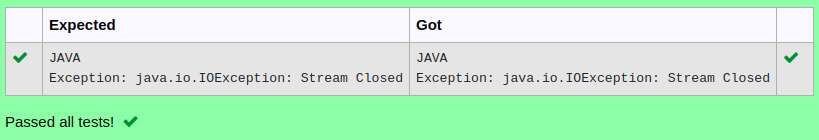

# Ex.No:9(A)          DATA I/O STREAM
## AIM:
To create a Java Program to store a String Value in a file "OutputFile.txt" using Data Output Stream.

## ALGORITHM :
1.  The program creates OutputFile.txt and initializes FileOutputStream and DataOutputStream. It prompts the user to enter a string, writes it to OutputFile.txt using writeUTF(), and then closes the streams.
2.	It reopens OutputFile.txt with FileInputStream and DataInputStream, reads the stored string using readUTF(), displays it, and then closes the streams.
3.	It deletes OutputFile.txt.
4.	After deletion, it tries to read an integer from OutputFile.txt, which causes an error because the file no longer exists.
5.	The program catches and displays an IOException message if any file-related error occurs, including the attempt to read after deletion.


## PROGRAM:
 ```
Program to implement a DATA I/O STREAM using Java
Developed by    : Sam Israel D 
RegisterNumber  : 212222230128 
```

## Sourcecode.java:


```java
FileInputStream input = new FileInputStream("OutputFile.txt");
DataInputStream di = new DataInputStream(input);
String data = di.readUTF();
System.out.println(data);
di.close();
input.close();
```


## OUTPUT:




## RESULT:
Thus the Java Program to store a String Value in a file "OutputFile.txt" using DataOutputStream was executed and verified successfully.

