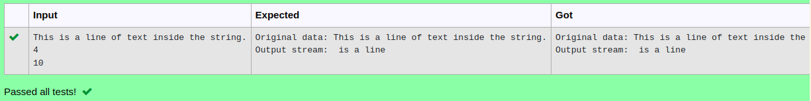

# Ex.No:9(B) BYTE ARRAY I/O
## AIM:
To create a java program to write data using ByteArrayOutputStream.


## ALGORITHM :
1.	The user enters a string (data), followed by two integers (start and length) specifying the starting position and number of characters to write.
2.	The string data is converted to a byte array (array).
3.	Using ByteArrayOutputStream, it writes length bytes from array, starting at start.
4.	The written data is retrieved as a string (streamData) and displayed, showing the original input and the specific segment written to the stream.
5.	Any exceptions are caught and handled, displaying stack trace information if an error occurs.


## PROGRAM:
 ```
Program to implement a BYTE ARRAY I/O using Java
Developed by    : Sam Israel D 
RegisterNumber  : 212222230128 
```

## Sourcecode.java:

```java
import java.io.ByteArrayOutputStream;
import java.util.*;
public class Main {
  public static void main(String[] args) 
  {
      Scanner sc = new Scanner(System.in);
      String str = sc.nextLine();
      int value1 = sc.nextInt();
      int value2 = sc.nextInt();
      System.out.println("Original data: "+str);
      try
      {
          ByteArrayOutputStream bout = new ByteArrayOutputStream();
          
          byte b[] = str.getBytes();
          bout.write(b, value1, value2);
          System.out.println("Output stream: "+bout);
          bout.close();
    }

    catch(Exception e) {
      e.getStackTrace();
    }
  }
}
```


## OUTPUT:




## RESULT:
Thus, java program to write data using ByteArrayOutputStream was executed and verified successfully.


