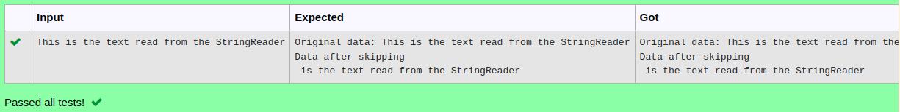

# Ex.No:9(C)             STRING READER
## AIM:
 To Create a Java Program to display and skip the specified number of characters using the predefined Method Skip in StringReader


## ALGORITHM :
1.  The user enters a string (data) and an integer (skipnumber) indicating the number of characters to skip.
2.	The original string is displayed for reference.
3.	A StringReader object, input, is created to read from data.
4.	The program skips the specified number of characters (skipnumber) in the string.
5.	It reads and displays the remaining characters one by one until the end of the string.
6.	Any exceptions are caught, and stack trace information is generated if an error occurs.


## PROGRAM:
 ```
Program to implement a String Reader using Java
Developed by    : Sam Israel D 
RegisterNumber  : 212222230128 
```

## Sourcecode.java:


```java
import java.io.StringReader;  
import java.util.*;
public class StringReaderExample 
{  
    public static void main(String[] args) throws Exception 
    {  
        Scanner sc = new Scanner(System.in);
        String data = sc.nextLine();
        System.out.println("Original data: "+data);
        try{
            StringReader sw = new StringReader(data);
            sw.skip(4);
            System.out.println("Data after skipping");
            int k=0;
            while((k=sw.read())!=-1){
                System.out.print((char)k);
            }
            sw.close();            
        }catch(Exception e){
            System.out.println(e);
        }

        
    }  
} 
```


## OUTPUT:




## RESULT:
Thus the Java Program to display and skip the specified number of characters using the predefined Method Skip in StringReader was executed and verified successfully.


