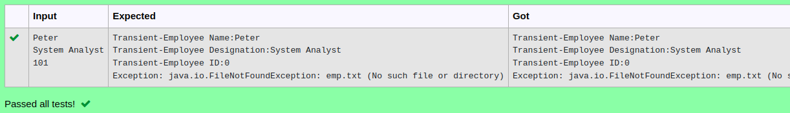

# Ex.No:9(D) TRANSIENT ---SERILIZATION

## AIM:
 To implement a Java program to perform Transient in Employee details in Serializable interface to make its object serialized.

## ALGORITHM :
1.	Get employee name and designation from the user.
2.	Save the Employeeinfo object to emp.txt.
3.	Read the object back from emp.txt.
4.	Print employee name and designation (designation is null due to transient).
5.	Delete File: Delete emp.txt and handle any exceptions while trying to read it.


## PROGRAM:
 ```
Program to implement a Transient using Java
Developed by    : Sam Israel D 
RegisterNumber  : 212222230128 
```

## Sourcecode.java:


```java
class Employeeinfo implements Serializable{
    String name, desi;
    transient int id;
    Employeeinfo(String name, String desi, int id){
        this.name = name;
        this.desi = desi;
        this.id = 0;
    }
}
```


## OUTPUT:




## RESULT:
Thus, implementation of a Java program to perform Transient in Employee details in Serializable interface to make its object serialized was executed and verified successfully.

