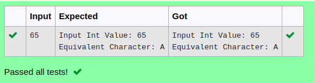

# Ex.No:9(E) STRING WRITER

## AIM:
To write a Java program that reads integer from the user and prints it using the StringWriter class.
## ALGORITHM :

a.	Start the program.
b.	Import java.io.* and java.util.Scanner.
c.	Create a Scanner object to read input from the user.
d.	Read an integer from the user.
e.	Create a StringWriter object.
f.	Write the integer to the StringWriter object.
g.	Print the result on the output screen.
h.	Close the writer.
i.	End the program.


## PROGRAM:
 ```
Program to implement a STRING WRITER
Developed by    : Sam Israel D 
RegisterNumber  : 212222230128 
```

## Sourcecode.java:

```java
import java.io.StringWriter;
import java.util.*;
public class Main {
  public static void main(String[] args) {

    
     Scanner sc=new Scanner(System.in);
     int data=sc.nextInt();
   
    try {
      StringWriter output = new StringWriter();
      output.write(data);
      System.out.println("Input Int Value: "+ data);
      System.out.println("Equivalent Character: "+ output);

      output.close();
    }

    catch(Exception e) {
      e.getStackTrace();
    }
  }
}
```


## OUTPUT:



## RESULT:
Thus, implementation of  a Java program was successfully reads a string from the user and uses StringWriter to write and print the string to the output screen.

