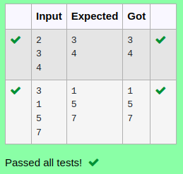

# Ex.No:10(A)         JAVA COLLECTION FRAMEWORK –ARRAY LIST
## AIM:
 To Create a Java Program to store n numbers (add elements of type Integer) and then display the n numbers using array List.

## ALGORITHM:
1.	Start the Program
2.	Import `java.util.*` for input handling and list functionality
3.	Define class `Snowdrop` with the `main` method:
-	a) Create `Scanner` object `sc` for input
-	b) Read an integer `n` to specify the number of elements
-	c) Create an `ArrayList` named `num` to store integers
4.	Use a `for` loop to:
-	a) Read `n` integers from input and add each to `num`
5.	Use an enhanced `for` loop to:
-	a) Iterate through `num` and print each element
6.	End

## PROGRAM:
 ```
Program to implement a ARRAY LIST using Java
Developed by    : Sam Israel D 
RegisterNumber  : 212222230128 
```

## Sourcecode.java:


```java
import java.util.*;
public class Main { 
  public static void main(String[] args) { 
    ArrayList<Integer> myNumbers = new ArrayList<Integer>();
    Scanner sc=new Scanner(System.in);
    int n=sc.nextInt();
    for(int i=0;i<n;i++)
    {
        myNumbers.add(sc.nextInt());
    }
    for (int i : myNumbers) {
      System.out.println(i);
    }
  } 
}
```


## OUTPUT:



## RESULT:
TThus the Java Program to store n numbers (add elements of type Integer) and then display the n numbers using array List was executed successfully.

