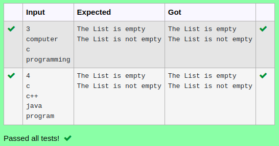

# Ex.No:10(C)             JAVA LIST INTERFACE
 ## AIM :

To Create a List interface implemented by arraylist class , adding n elements to object of List interface and display the list is empty or not.


## ALGORITHM :
1.	Start
2.	Import `java.util.*`
3.	Define class `Main` with `main` method:
-	a) Initialize `Scanner` and an empty `ArrayList` named `list`
-	b) Read integer `n`
4.	Check if `list` is empty, print corresponding message
5.	Use a loop to add `n` strings to `list`
6.	Check if `list` is empty again, print corresponding message
7.	End

## PROGRAM:
 ```
Program to implement a JAVA LIST INTERFACE using Java
Developed by    : Sam Israel D 
RegisterNumber  : 212222230128 
```

## Sourcecode.java:


```java
import java.util.*;


public class GFG {

	public static void main(String args[])
	{
		Scanner sc=new Scanner(System.in);
		
        int size=sc.nextInt();
        List<String> arr = new ArrayList<String>();
  
        boolean ans = arr.isEmpty();
        if (ans == true)
            System.out.println("The List is empty");
        else
            System.out.println("The List is not empty");
  
      
        for(int i=0;i<size;i++)
        {
				arr.add(sc.next());
        }
        
        
        ans = arr.isEmpty();
        if (ans == true)
            System.out.print("The List is empty");
        else
            System.out.println("The List is not empty");
        

		
	
	}
}
```


## OUTPUT:



## RESULT:
Thus the java program implemented a List interface for array list was executed and verified successfully.


