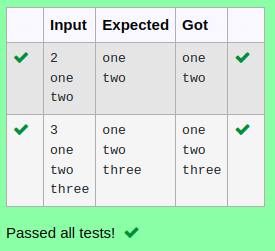

# Ex.No:10(D) JAVA HASHSET & LINKEDHASHSET

## AIM:

To create a java program use hashset concepts in collection and add the elements to the hashset and then display the elements iterate(use while) in an unordered collection.

## ALGORITHM :

1. Start the Program.
2. Import `java.util.*`
3. Define class `Main` with `main` method:

- a) Initialize `Scanner` and read integer `n`
- b) Create a `HashSet` named `hs` to store unique strings

4. Use a loop to read `n` strings and add each to `hs`
5. Use an enhanced `for` loop to print each element in `hs`
6. End

## PROGRAM:

```
Program to implement a JAVA HASHSET & LINKEDHASHSET using Java
Developed by    : Sam Israel D
RegisterNumber  : 212222230128
```

## Sourcecode.java:

```java
import java.util.*;

public class HashSetDemo{

    public static void main(String args[]){
        
        HashSet <String> hs = new HashSet <String>();
        Scanner sc=new Scanner(System.in);
        int n=sc.nextInt();
        for(int i=0;i<n;i++)
        {
            hs.add(sc.next());

        }
         Iterator<String> i=hs.iterator();
         while(i.hasNext())
         {
            System.out.println(i.next());
         }

        }
}   
```

## OUTPUT:



## RESULT:

Thus the java program of hashmap concepts was executed and verified successfully.
