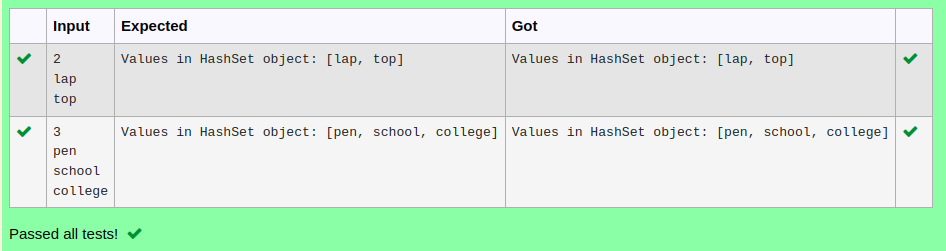

# Ex.No:10(E)  JAVA LINKEDHASH SET

## AIM:
To write a Java program using LinkedHashSet to store unique elements in insertion order, display all elements, and show the total size of the set.
## ALGORITHM :
a.	Import java.util.LinkedHashSet.
b.	Create a LinkedHashSet of type String.
c.	Add some elements using .add() method.
d.	Print all the elements in the set using a loop.
e.	Use .size() method to get and print the number of elements in the set.


## PROGRAM:
 ```
Program to implement a LINKEDHASH SET
Developed by    : Sam Israel D
RegisterNumber  : 212222230128
```

## Sourcecode.java:


```java
import java.util.*;
public class HashSetDemo{
    public static void main(String[] args){
        LinkedHashSet<String> hs=new LinkedHashSet<String>();
        Scanner sc=new Scanner(System.in);
        int n=sc.nextInt();
        for(int i=0;i<n;i++){
            hs.add(sc.next());
        }
        System.out.println("Values in HashSet object: "+hs);
    }
}
```


## OUTPUT:



## RESULT:

Thus the java program was successfully uses LinkedHashSet to store and display elements while maintaining insertion order and ensuring uniqueness. It also shows the correct count of unique elements. 
