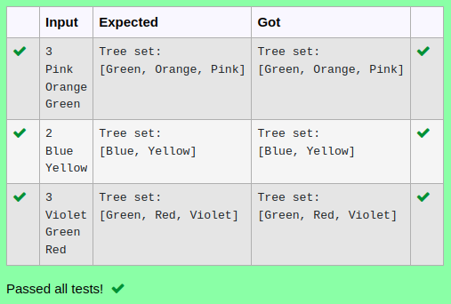

# Ex.No:11(A)         JAVA TREESET
## AIM:
 To develop a Java program to iterate through all elements in a tree set.


## ALGORITHM :
1.	Start
2.	Import `java.util.*`
3.	Define class `Main` with `main` method:
-	a) Initialize `Scanner` and read integer `n`
-	b) Create a `TreeSet` named `set` to store integers in sorted order
4.	Use a loop to read `n` integers and add each to `set`
5.	Use an enhanced `for` loop to print each element in `set`
6.	End


## PROGRAM:
 ```
Program to implement a JAVA TREESET using Java
Developed by    : Sam Israel D
RegisterNumber  : 212222230128
```

## Sourcecode.java:


```java
import java.util.*;
public class Main{
    public static void main(String[] args){
        Scanner sc = new Scanner(System.in);
        int n = sc.nextInt();
        TreeSet<String> ts = new TreeSet<String>();
        for(int i=0;i<n;i++){
            ts.add(sc.next());
        }
        System.out.println("Tree set:");
        System.out.println(ts);
    }
}
```


## OUTPUT:



## RESULT:
Thus the java program to iterate through all elements in a tree set was executed successfully.

