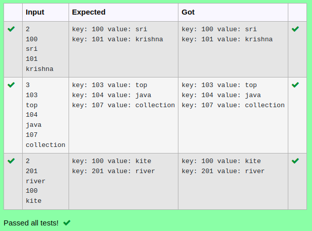

# Ex.No:11(B)   JAVA MAP & HASHMAP AND HASHTABLE
## AIM :
To Create a java program to retrieve the key and value from hashtable for all input value.

## ALGORITHM :

1.	Start
2.	Import `java.util.*`
3.	Define class `A` with `main` method:
-	a) Initialize `Scanner` and read integer `n`
-	b) Create a `Hashtable` named `hash` to store integer keys and string values
4.	Use a loop to:
-	a) Read an integer and string from the user
-	b) Add the integer as the key and the string as the value in `hash`
5.	Use an enhanced `for` loop to iterate through `hash` and print each key-value pair
6.	End


## PROGRAM:
 ```
Program to implement a JAVA MAP & HASHMAP AND HASHTABLE using Java
Developed by    : Sam Israel D
RegisterNumber  : 212222230128
```

## Sourcecode.java:


```java
import java.util.*;
public class Main{
    public static void main(String[] args){
        Scanner sc = new Scanner(System.in);
        int n = sc.nextInt();
        HashMap<Integer, String> map = new HashMap<Integer, String>();
        for(int i=0;i<n;i++){
            map.put(sc.nextInt(), sc.next());
        }
        Iterator<Integer> iter = map.keySet().iterator();
        while(iter.hasNext()){
            int key = iter.next();
            System.out.println("key: "+key+" value: "+map.get(key));
        }
    }
}
```


## OUTPUT:



## RESULT:
Thus the java program to retrieve the key and value from hashtable for all input value was executed successfully.


