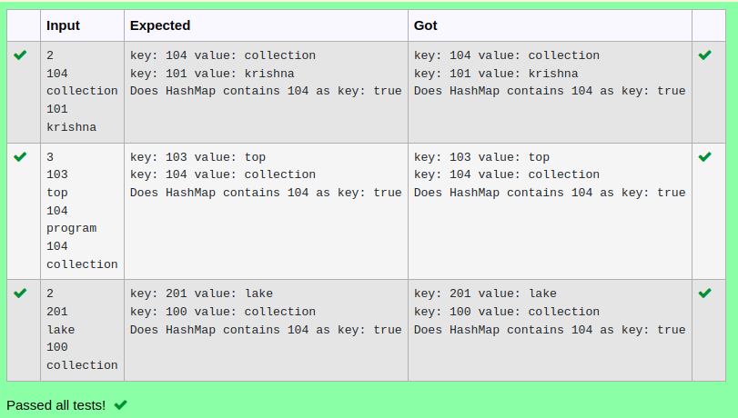

# Ex.No:11(C)             JAVA LINKED HASHMAP
 ## AIM :

To Create a java program to display the contains key of 104 and to retrieve the key and value using linked hash map.

## ALGORITHM :

1.	Start the Program
2.	Import `java.util.*`
3.	Define class `A` with `main` method:
-	a) Initialize `Scanner` and read integer `n`
-	b) Create a `LinkedHashMap` named `hash` to store integer keys and string values
4.	Use a loop to:
-	a) Read an integer and string from the user
-	b) Add the integer as the key and the string as the value in `hash`
5.	Use an enhanced `for` loop to iterate through `hash` and print each key-value pair
6.	Check if the `hash` contains the key `104` and print the result
7.	End


## PROGRAM:
 ```
Program to implement a JAVA LINKED HASH MAP using Java
Developed by    : Sam Israel D
RegisterNumber  : 212222230128
```

## Sourcecode.java:

```java
import java.util.*;
public class Mapp {
    public static void main(String args[]) {

        LinkedHashMap < Integer, String > map = new LinkedHashMap < > ();
        Scanner sc = new Scanner(System.in);

        int size = sc.nextInt();
        for (int i = 0; i < size; i++) {
            Integer a = sc.nextInt();
            String b = sc.next();
            map.put(a, b);
        }

        for (Map.Entry m: map.entrySet()) {
            System.out.println("key: " + m.getKey() + " value: " + m.getValue());
        }

        System.out.println("Does HashMap contains 104 as key: " + map.containsValue("collection"));

    }
}
```


## OUTPUT:



## RESULT:
Thus the  java program to display the contains key of 104 and to retrieve the key and value using linked hash map was executed successfully.


