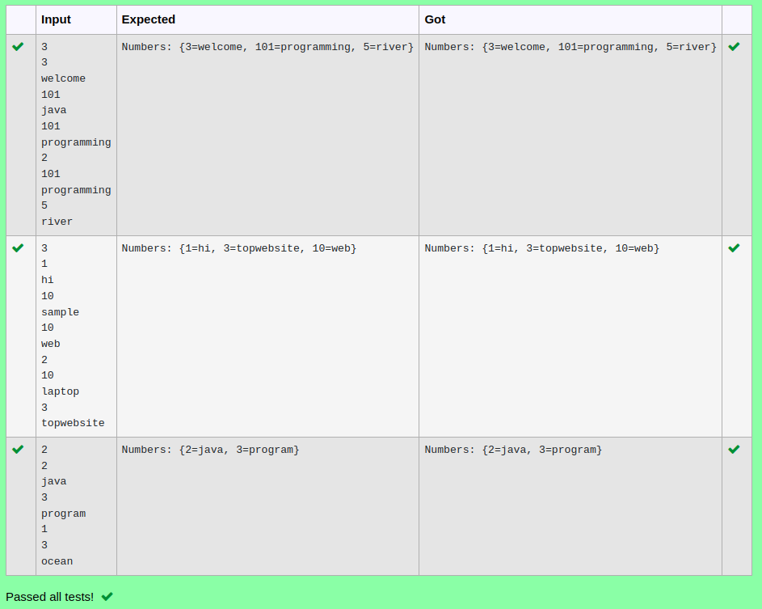

# Ex.No:11(D) RELATED TO MAP CONCEPTS

## AIM:
To Create a java program to insert and display the key and values using map interface.

## ALGORITHM :

1.	Start
2.	Import `java.util.*`
3.	Define class `Deivamagal` with `main` method:
-	a) Read integer `n` (number of entries).
-	b) Create a `HashMap` `hash`.
4.	Loop to read key-value pairs and add to `hash`.
5.	Print `"Map: " + hash`, keys, values, and entries.
6.	End


## PROGRAM:
 ```
Program to implement a RELATED TO MAP CONCEPTS using Java
Developed by    : Sam Israel D
RegisterNumber  : 212222230128
```

## Sourcecode.java:

```java
import java.util.*;
public class Mapp {
    public static void main(String args[]) {

        Map < Integer, String > map = new HashMap < Integer, String > ();
        Scanner sc = new Scanner(System.in);

        int size = sc.nextInt();
        for (int i = 0; i < size; i++) {
            Integer a = sc.nextInt();
            String b = sc.next();
            map.put(a, b);
        }
        HashMap < Integer, String > numbers = new HashMap < > ();
        int size1 = sc.nextInt();
        for (int i = 0; i < size1; i++) {
            Integer a = sc.nextInt();
            String b = sc.next();
            numbers.put(a, b);
        }
        numbers.putAll(map);
        System.out.println("Numbers: " + numbers);


    }
}
```


## OUTPUT:



## RESULT:
Thus the java program to insert and display the key and values using map interface was  executed and verified successfully.


