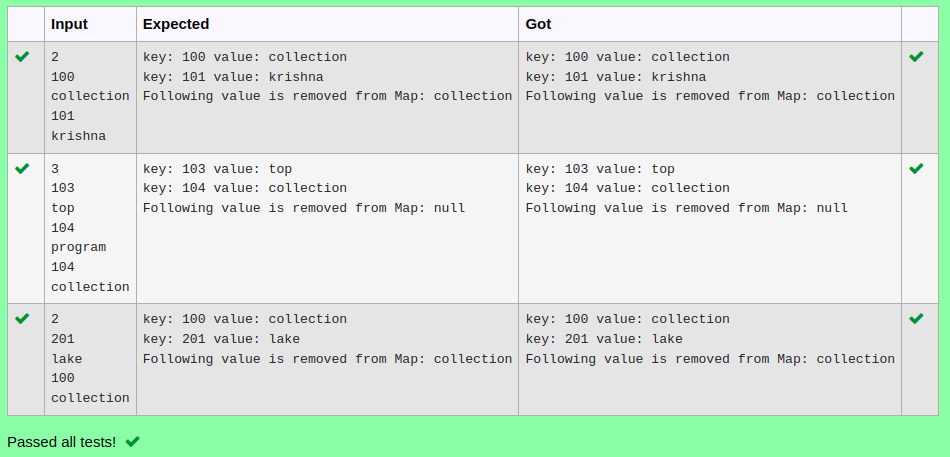

# Ex.No:11(E)  JAVA HASHMAP

## AIM:
To demonstrate removing a key from a HashMap and printing all remaining key-value pairs
## ALGORITHM :

a.	Import java.util.*.
b.	Create a HashMap and add some key-value pairs.
c.	Use remove(key) to delete the entry with key 100.
d.	Iterate through the map using a for-each loop and display the entries

## PROGRAM:
 ```
Program to implement a HASHMAP
Developed by    : Sam Israel D
RegisterNumber  : 212222230128
```

## Sourcecode.java:


```java
import java.util.*;
public class Mapp {
    public static void main(String args[]) {

        HashMap < Integer, String > map = new HashMap < Integer, String > ();
        Scanner sc = new Scanner(System.in);

        int size = sc.nextInt();
        for (int i = 0; i < size; i++) {
            Integer a = sc.nextInt();
            String b = sc.next();
            map.put(a, b);
        }


        Iterator < Integer > keySetIterator = map.keySet().iterator();
        while (keySetIterator.hasNext()) {
            Integer key = keySetIterator.next();
            System.out.println("key: " + key + " value: " + map.get(key));
        }

        Integer key = 100;
        Object value = map.remove(key);
        System.out.println("Following value is removed from Map: " + value);


    }
}
```


## OUTPUT:




## RESULT:
Thus the java program was successfully removes the key 100 from the HashMap and displays the remaining key-value pairs.


