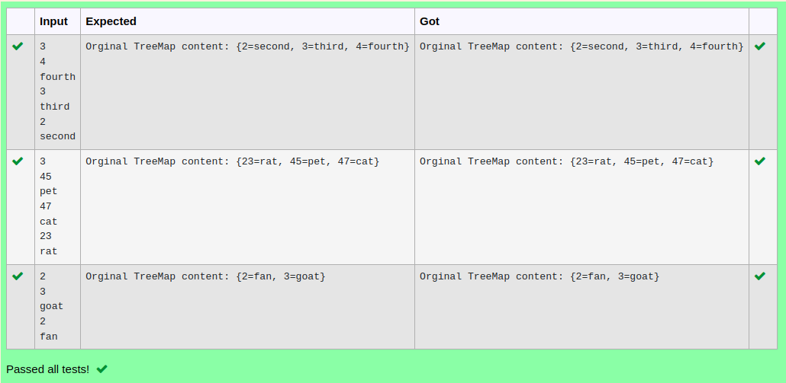

# Ex.No:12(A)         JAVA TREE MAP
## AIM:
 To implement a Java program to associate the specified value with the specified key in a Tree Map.

## ALGORITHM :

1.	Start the Program
2.	Import `java.util.*` and `java.util.Map.Entry`
3.	Define `Example6` class with `main` method:
-	a) Initialize `TreeMap<String, String> tree_map1`
-	b) Read integer `size` for entries count.
4.	Use a loop to:
-	a) Read `String` values `n1` and `s1`
-	b) Insert each pair into `tree_map1`
5.	Print `tree_map1` as `"Original TreeMap content: "`
6.	Define `sort_key` class that implements `Comparator<String>`:
-	Override `compare` method to compare `String` values `str1` and `str2` using
`compareTo`
7.	End


## PROGRAM:
 ```
Program to implement a JAVA TREE MAP using Java
Developed by    : Sam Israel D
RegisterNumber  : 212222230128
```

## Sourcecode.java:

```java
import java.util.*;

public class Example6 {
    public static void main(String args[]) {
        TreeMap<String, String> tree_map1 = new TreeMap<String, String>();
        Scanner sc = new Scanner(System.in);
        int size = sc.nextInt();
        for (int i = 0; i < size; i++) {
            String n1 = sc.next();
            String s1 = sc.next();
            tree_map1.put(n1, s1);
        }
        System.out.println("Orginal TreeMap content: " + tree_map1);
    }
}

class sort_key implements Comparator<String> {
    @Override
    public int compare(String str1, String str2) {
        return str1.compareTo(str2);
    }
}
```


## OUTPUT:



## RESULT:
Thus the Java program to associate the specified value with the specified key in a Tree Map was executed successfully.