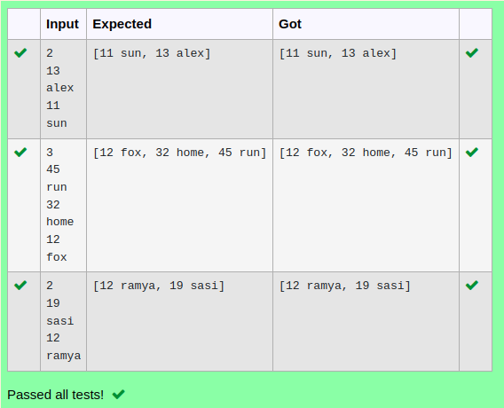

# Ex.No:12(B)   COMPARABLE & COMPARATOR INTERFACE
## AIM :
To Write a java program to sort using treeset collection,this object needs to be passed in the constructor of TreeSet. Sorting elements in a collection using Comparator interface, we need to pass the class object that implements Comparator interface.Finally Display it.

## ALGORITHM :

1. **Start the Program.**
2. **Import** `java.util.*`
3. **Define `Student` class**:
   - a) Declare integer `roll` and `String name`.
   - b) Create a constructor to initialize `roll` and `name`.
   - c) Override `toString()` method to return formatted `roll` and `name`.
4. **Define `MyComparator` class** that implements `Comparator<Student>`:
   - a) Override `compare(Student s1, Student s2)` method.
   - b) Return:
     - `0` if `s1.roll == s2.roll`
     - `1` if `s1.roll > s2.roll`
     - `-1` otherwise
5. **Define `Test` class with `main` method**:
   - a) Create `TreeSet<Student>` object `ts` using `MyComparator`.
   - b) Create a `Scanner` object to read input.
   - c) Read an integer `size` (number of students).
6. **Loop `size` times**:
   - a) Read integer `roll` and `String name`.
   - b) Create a `Student` object and add it to `ts`.
7. **Print the `TreeSet`** (will display students sorted by `roll`).
8. **End**


## PROGRAM:
 ```
Program to implement a COMPARABLE & COMPARATOR INTERFACE using Java
Developed by    : Sam Israel D
RegisterNumber  : 212222230128
```

## Sourcecode.java:

```java
import java.util.*;

class Student {
    int roll;
    String name;

    Student(int r, String n) {
        roll = r;
        name = n;
    }

    public String toString() {
        return roll + " " + name;
    }
}

class MyComparator implements Comparator<Student> {
    public int compare(Student s1, Student s2) {
        if (s1.roll == s2.roll) return 0;
        else if (s1.roll > s2.roll) return 1;
        else return -1;
    }
}

public class Test {
    public static void main(String[] args) {
        TreeSet<Student> ts = new TreeSet<Student>(new MyComparator());
        Scanner sc = new Scanner(System.in);
        int size = sc.nextInt();
        for (int i = 0; i < size; i++) {
            ts.add(new Student(sc.nextInt(), sc.next()));
        }
        System.out.println(ts);
    }
}

```


## OUTPUT:



## RESULT:
Thus the java program to compare two elements , if element is greater means display 1 otherwise display -1 use only comparable interface in java collection was executed successfully


