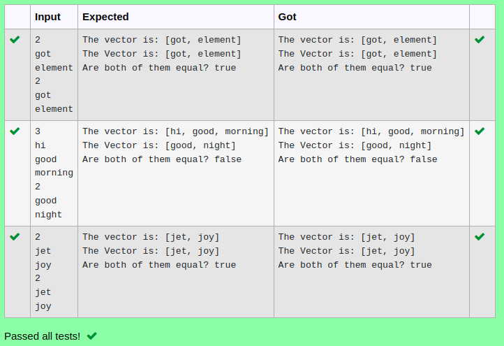

# Ex.No:12(C)             JAVA STACK & VECTOR
 ## AIM :

To Write a java program to create vector and read the elements for two vector in java collection.(Use equals method )
## ALGORITHM :

1.	Start the Program
2.	In `main`:
-	a) Create a `Scanner` object to read input.
-	b) Read an integer `n1` (the size of the first vector).
-	c) Initialize `Vector<String> vector1`.
-	d) Use a `for` loop to read `n1` strings and add each to `vector1`.
3.	Repeat similar steps for a second vector:
a)	Read an integer `n2` (size of the second vector).
b)	Initialize `Vector<String> vector2`.
c)	Use a `for` loop to read `n2` strings and add each to `vector2`.
4.	Use `equals()` to compare `vector1` and `vector2` and print whether they are equal.
5.	End.


## PROGRAM:
 ```
Program to implement a JAVA STACK & VECTOR  using Java
Developed by    : Sam Israel D
RegisterNumber  : 212222230128
```

## Sourcecode.java:


```java
import java.util.*;

public class VectorDemo {
    public static void main(String args[]) {
        Vector<String> vector1 = new Vector<String>();
        Scanner sc = new Scanner(System.in);
        
        int size = sc.nextInt();
        for (int i = 0; i < size; i++) {
            vector1.add(sc.next());
        }
        System.out.println("The vector is: " + vector1);

        Vector<String> vector2 = new Vector<String>();
        int size2 = sc.nextInt();
        for (int i = 0; i < size2; i++) {
            vector2.add(sc.next());
        }

        System.out.println("The Vector is: " + vector2);
        System.out.println("Are both of them equal? " + vector1.equals(vector2));
    }
}
```


## OUTPUT:



## RESULT:

Thus the java program to create vector and read the elements for two vector in java collection.(Use equals method ) was executed successfully.


