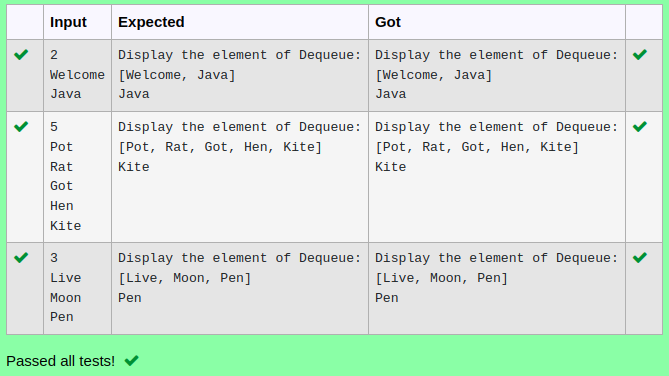

# Ex.No:12(D) JAVA QUEUE
## AIM:
To Write a java program to display the removal  element from the Dequeue using pollLast method  in java collection.(Use string)


## ALGORITHM :
1.	Start the Program
2.	Import `Dequeue` and `Scanner`
3.	Define class `Main` with `main` method:
-	a) Initialize `Scanner` to read input
-	b) Create a `Dequeue` of integers
4.	Read integer `n` from user input for the number of elements
5.	Use a loop to:
-	a) Read integers and add them to the `Dequeue`
6.	Check if the `Dequeue` is not empty:
-	a) Remove and display the least-priority element using `pollLast()`
7.	Display the remaining elements in the `Dequeue`
8.	End.


## PROGRAM:
 ```
Program to implement a JAVA QUEUE using Java
Developed by    : Sam Israel D
RegisterNumber  : 212222230128
```

## Sourcecode.java:


```java
import java.util.*;

public class DeQueueDemo {
    public static void main(String args[]) {
        Deque<String> dq = new ArrayDeque<String>();
        Scanner sc = new Scanner(System.in);
        int size = sc.nextInt();
        for (int i = 0; i < size; i++) {
            dq.add(sc.next());
        }
        System.out.println("Display the element of Dequeue:");
        System.out.println(dq);
        System.out.println(dq.getLast());
    }
}
```


## OUTPUT:



## RESULT:
Thus the java program to display the removal  element from the Dequeue using pollLast method in java collection was executed successfully.


