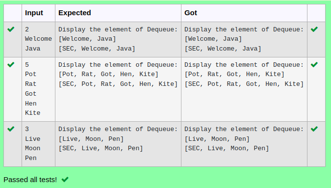

# Ex.No:12(E)  JAVA DEQUEUE

## AIM:
To demonstrate how to remove and display the first element from a Deque using the pollFirst() method in Java Collections with String values.
## ALGORITHM :

1.	Import java.util.*.
2.	Create a Deque using LinkedList.
3.	Add several string elements to the deque.
4.	Use pollFirst() to remove and return the first element.
5.	Print the removed element.
6.	Display the remaining elements in the deque.

## PROGRAM:
 ```
Program to implement a JAVA DEQUEUE
Developed by    : Sam Israel D
RegisterNumber  : 212222230128
```

## Sourcecode.java:


## OUTPUT:



## RESULT:

Thus the java program successfully demonstrates how to use pollFirst() to remove and display the first element from a Deque of strings.


